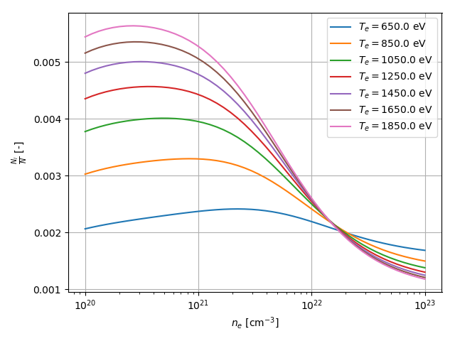

.. _usage-examples:

Usage examples
==============

On the following lines are described a few basic usage examples of the package GainCalculator. It is assumed that you
already have GainCalculator properly installed on your computer. If that is not the case please refer to the section
:ref:`getting-started`.

Calculating relative electron populations
-----------------------------------------

In this example GainCalculator is used to calculate the relative electron populations on a given energy level as a
function of density for a few different temperatures.

Specifically the energy level
:math:`[1s+]^2_0(0) [2s+]^2_0(0) [2p-]^1_1(1) [2p+]^4_0(1) [3p-]^1_1(0)` in neon like germanium is considered.
The aim of this example is to calculate relative population for densities ranging from
:math:`10^{20}` :math:`cm^{-3}` to :math:`10^{23}` :math:`cm^{-3}` and set of of temperatures
:math:`{650, 850, ..., 1850}` given in eV and then visualize the result.

First you should specify the appropriate imports. In this example we will use the following::

    import gain_calculator as gc
    from matplotlib import pyplot as plt
    import numpy as np

Before you do anything with GainCalculator you
must initialize it, this initializes the ray parallelization library::

    gc.init()

Then you should setup the atom and energy level. The calculation must be done for all energy levels in the atom so
here you specify energy levels up to which shell you want to include. This is given by the parameter config_groups of
Atom. Results that depend only on atom type are stored in folder given by argument data_folder. Next time the
calculation is performed these will be loaded::

    energy_level = gc.EnergyLevel("1s+2(0)0 2s+2(0)0 2p-1(1)1 2p+4(0)1 3p-1(1)0")
    atom = gc.Atom(
        symbol="Ge",
        config_groups=gc.ConfigGroups(base="1*2 2*8", max_n=6),
        data_folder=os.path.join(os.path.abspath(os.path.dirname(__file__)), "atomic_data")
    )

Next to calculate get the relative population you should use the method atom.get_combined_populations(),
you could specify the sum of all populations using the parameter population_total, but it is 1 by default
(meaning result will be relative population)::

    temperatures = [650.0, 850.0, 1050.0, 1250.0, 1450.0, 1650.0, 1850.0]
    population_values = atom.get_combined_populations(
        energy_level=energy_level,
        temperatures=temperatures,
        electron_densities=np.logspace(20, 23),
        log=lambda current, total: gc.print_progress(current, total, "Generating populations:")
    )

The calculation will run in parallel using ray workers. The result will be a numpy structured list with three fields:
**population**, **electron_density** and **temperature**. The progress will be logged using the log optional parameter.

To visualize the data use a simple for loop. Simply mask out the data for temperatures you dont want and store the
new list in a variable called relevant. Then plot the dependency of reduced population on density utilizing x axis
logarithmic scale (reduced population is population divided by the degeneracy of the energy level)::

    for temperature in temperatures:
        relevant = population_values[population_values["temperature"] == temperature]
        densities = relevant["electron_density"]
        populations = relevant["population"] / energy_level.degeneracy
        plt.semilogx(densities, populations, label=u"$T_e = {}$ eV".format(temperature))

Lastly set the properties of the plot and save the figure::

    plt.xlabel(u"$n_e$ [cm$^{-3}$]")
    plt.ylabel(u"$\\frac{N_i}{N}$ [-]")
    plt.grid()
    plt.legend()
    plt.tight_layout()
    plt.savefig("images/populations_Ge_2p-3p-.png")

To wrap up here is the complete source code of the example::

    import gain_calculator as gc
    from matplotlib import pyplot as plt
    import numpy as np

    if __name__ == "__main__":

        # Setup
        gc.init()
        energy_level = gc.EnergyLevel("1s+2(0)0 2s+2(0)0 2p-1(1)1 2p+4(0)1 3p-1(1)0")
        atom = gc.Atom(
            symbol="Ge",
            config_groups=gc.ConfigGroups(base="1*2 2*8", max_n=6)
        )

        # The main calculation
        temperatures = [650.0, 850.0, 1050.0, 1250.0, 1450.0, 1650.0, 1850.0]
        population_values = atom.get_populations(
            energy_level=energy_level,
            temperatures=temperatures,
            electron_densities=np.logspace(20, 23)
        )

        # Plotting
        for temperature in temperatures:
            relevant = population_values[population_values["temperature"] == temperature]
            densities = relevant["electron_density"]
            populations = relevant["population"] / energy_level.degeneracy
            plt.semilogx(densities, populations, label=u"$T_e = {}$ eV".format(temperature))

        plt.xlabel(u"$n_e$ [cm$^{-3}$]")
        plt.ylabel(u"$\\frac{N_i}{N}$ [-]")
        plt.grid()
        plt.legend()
        plt.tight_layout()
        plt.savefig("images/populations_Ge_2p-3p-.png")

This source code is located in file called population_state_dependence.py inside examples folder. This
folder is within the root directory of GainCalculator. Executing this scripts results in image file named
"populations_Ge_2p-3p-.png" being created inside the images folder (if the folder does not exist, user must create one).
The image should look like this:

